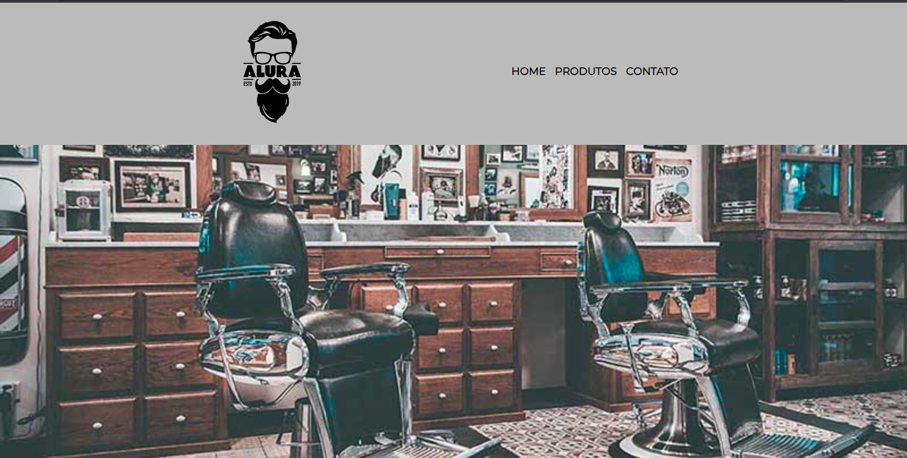

<h1 align="center">Barbearia Alura</h1>

  Projeto feito no primeiro curso do Alura, conhecendo HTML e CSS.

  

## 🚀 Tecnologias

Esse projeto foi desenvolvido com as seguintes tecnologias:

- HTML e CSS
## 💻 Projeto

- O Projeto Barbearia Alura são os meus primeiros passos na programação, aprendendo os conceitos básicos de desenvolvimento web.

## LINK

- https://cursos.alura.com.br/course/html5-css3-avancando-css
